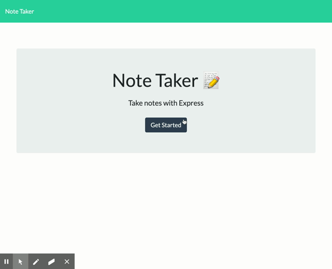

[](https://github.com/keycole)&nbsp;&nbsp;&nbsp;[](mailto:nicole.graiff@gmail.com)

# Take Note

## Description
 An application that can be used to write, save, and delete notes. This application uses an express backend to save and retrieve note data from a JSON file.

**Deployed Application:** https://boiling-journey-11707.herokuapp.com/

#### Table of Contents

[Demo](#demo) &nbsp;&nbsp;| &nbsp;&nbsp; [Installation](#installation) &nbsp;&nbsp; | &nbsp;&nbsp; [Usage](#usage) &nbsp;&nbsp; | &nbsp;&nbsp; [Contributing](#contributing) &nbsp;&nbsp; | &nbsp;&nbsp; [License](#license) &nbsp;&nbsp; |  &nbsp;&nbsp; [Questions](#questions)

## Demo

**Link to demo video:** https://drive.google.com/file/d/1xd_HuE9q4tzOcu_xlyZJOjw6m3T02Lbb/view



## Usage

- This application is meant to be used for taking notes on the go.
- Quickly access the app from any device and use it to capture your thoughts before the busy pace of life clouds them from your memory.
- Access stored notes, add, or delete entries from the /notes page. 

## Contributing

- Fork the repository
- Navigate to the folder containing app.js in the terminal and enter ```npm install``` to download dependencies
- Add your stamp to the program's functionality and be sure to reach out with your update/improvements. I would like to see what you've done! 

## License

[](https://opensource.org/licenses/MIT)

## Questions

- Please click the "Ask me anything" badge at the top of the page if you have any questions about this application.